# 对`dqrinc`和`dqrdec`的测试

所有的矩阵都由`numpy`的`random`函数生成，其中的元素都是 $[0,1]$ 之间的随机数。并且里面的元素是双精度浮点数。

## 1. `dqrinc`的测试

采用对 $n\times5$ 的矩阵依次在最后一列增添列，测试`dqrinc`的正确性。其中 $n$ 取$500,1000,6000$

通过先后计算

- $A$ 与 $QR$ 的误差
- $Q^TQ$ 与 $I$ 的误差
- $R^TR$ 与 $A^TA$ 的误差

来测试`dqrinc`的正确性。其中误差取 $||\cdot||_2$ 范数。

下面的图片依次反应了上述三个误差的变化。

### 1.1 $n=500$

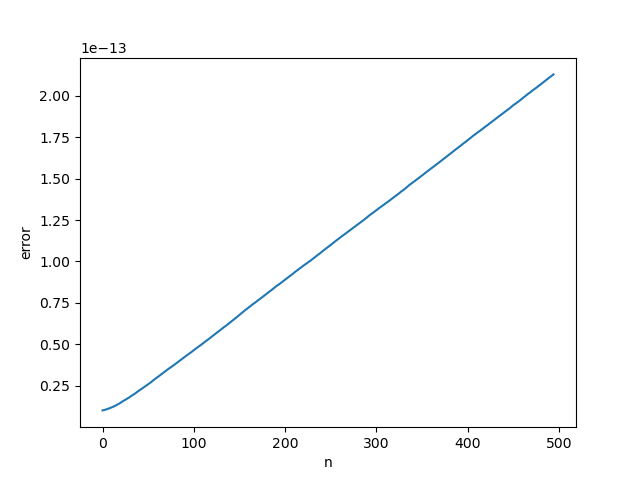

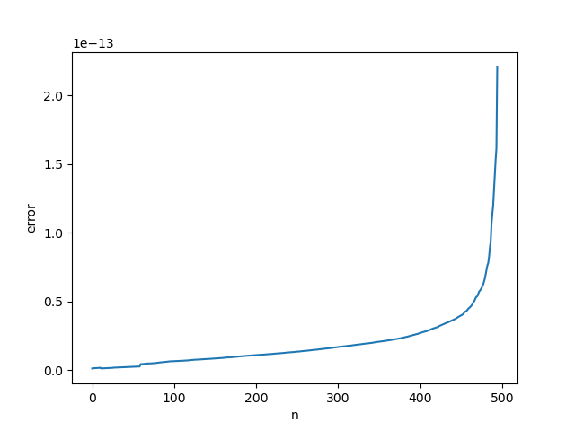

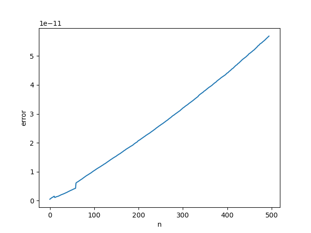

### 1.2 $n=1000$

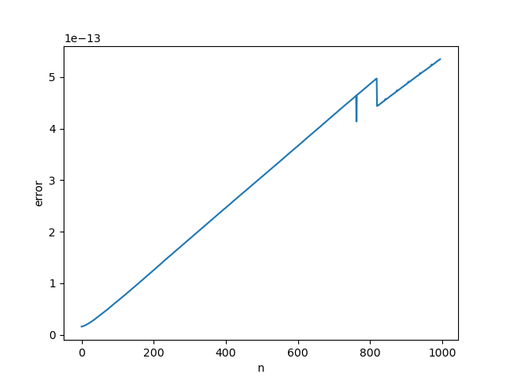

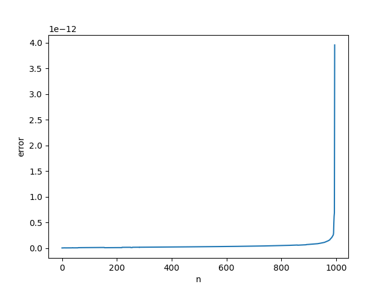

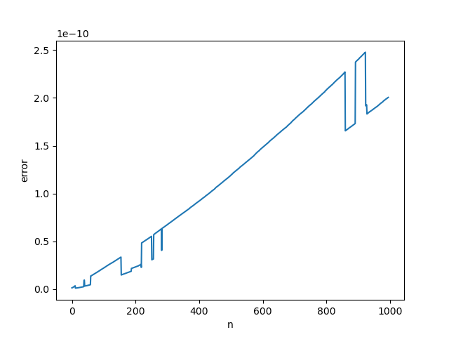

### 1.3 更大的 $n$

$n=6000$ 时的 $A$ 与 $QR$ 的误差和 $Q$ 的正交性：

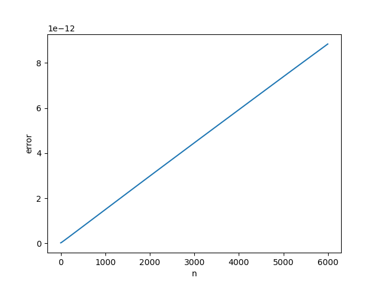

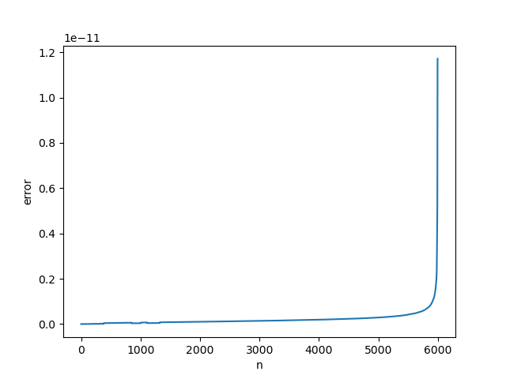

$n=3000$ 时的 $R^TR$ 与 $A^TA$ 的误差:


## 2. `dqrdec`的测试

采用对 $n\times5$ 的矩阵依次在最后一列增添列，后再依次删去最后一列，直到恢复到原来的大小，测试`dqrdec`的正确性。

计算的标准和上面一样。

下面的图片依次反应了上述三个误差的变化。

### 2.1 $n=500$

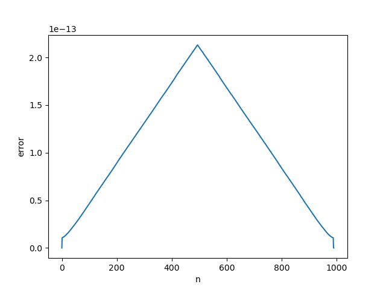

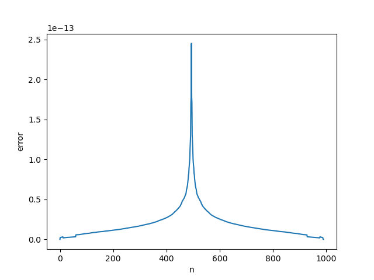

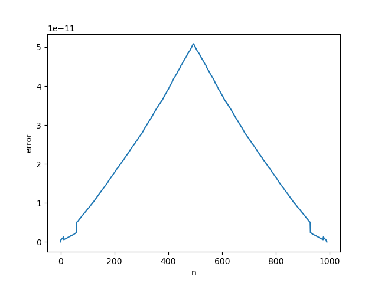

### 2.2 $n=1000$

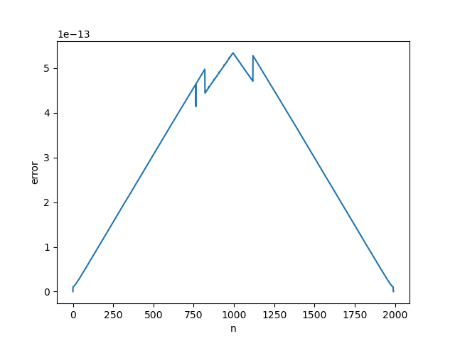

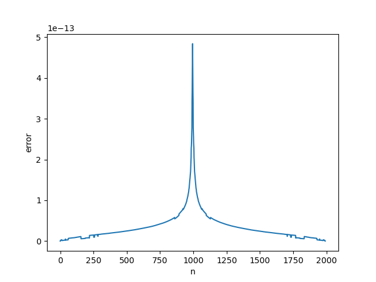

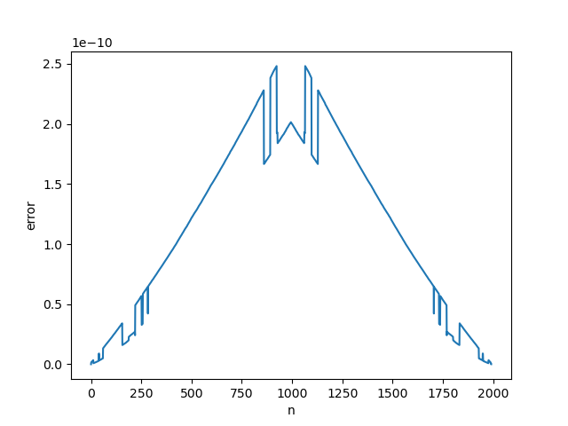

### 2.3 $n=3000$

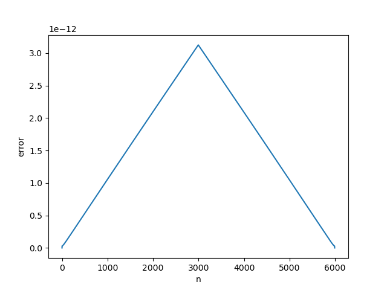

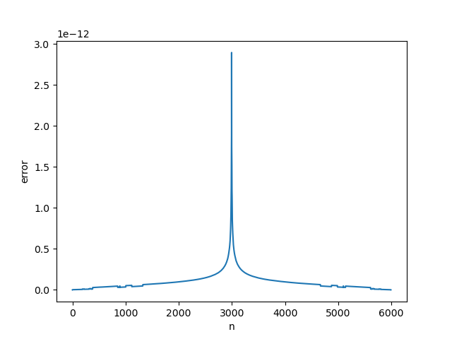

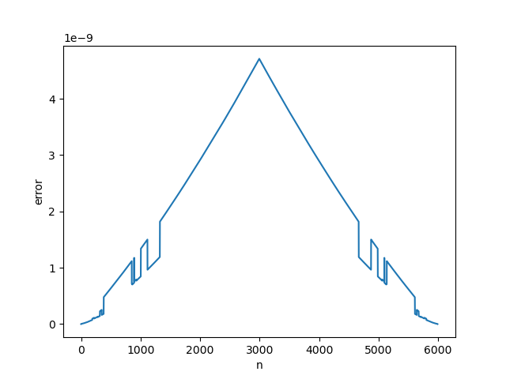

### 2.4 $n=6000$

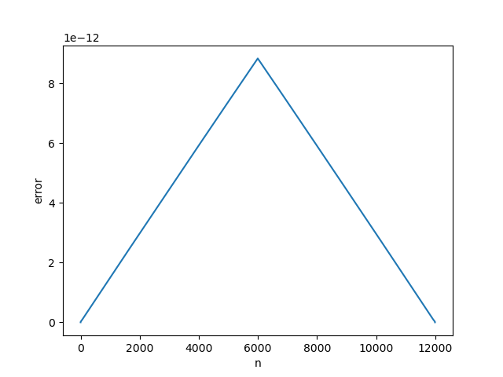

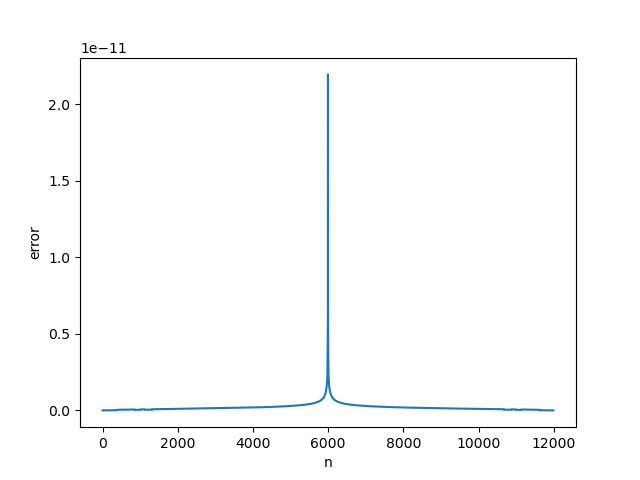

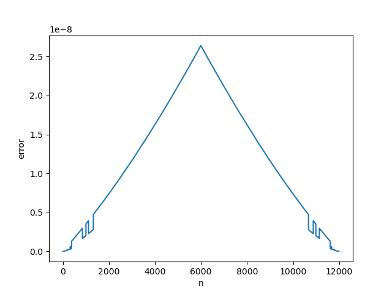

之前，我们用二范数衡量误差，可能由于规模的影响而标准不一。采用一范数，即**矩阵列的绝对值之和的最大值**，在列的规模不变的情况下，可能更加合适。

下面的图片依次反应了上述三个误差的变化。

### 2.5 $n=600$

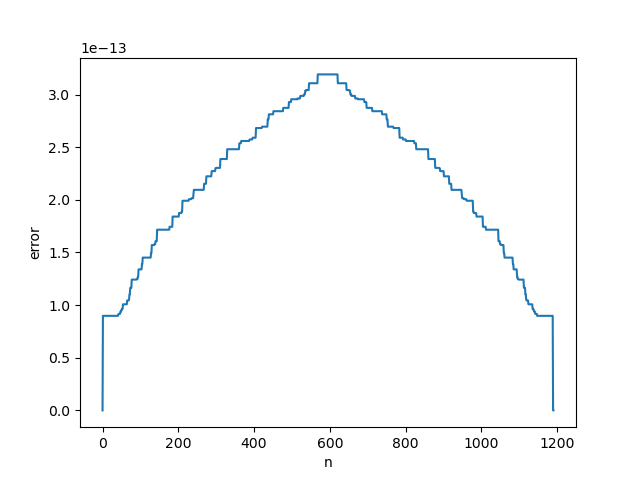

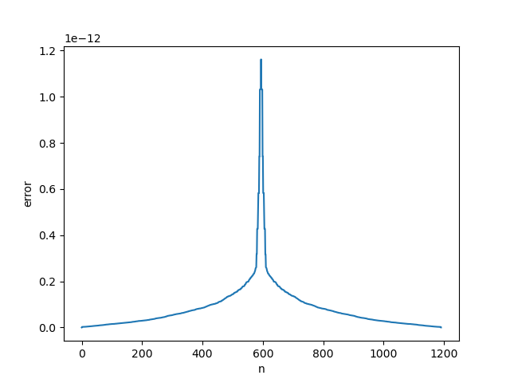

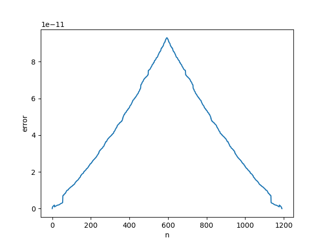

### 2.6 $n=1000$

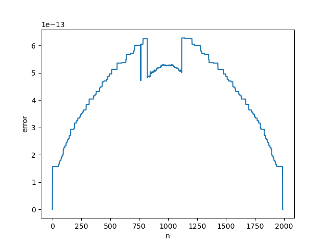

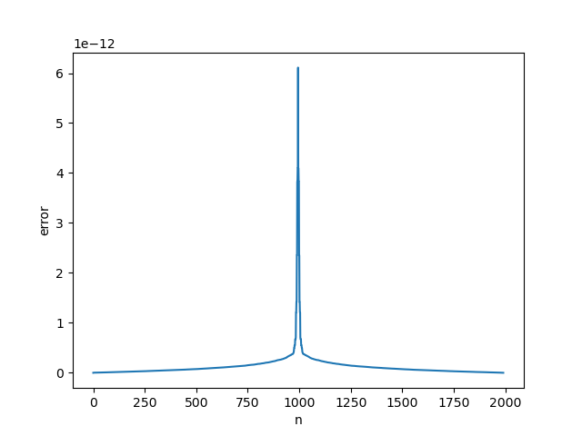

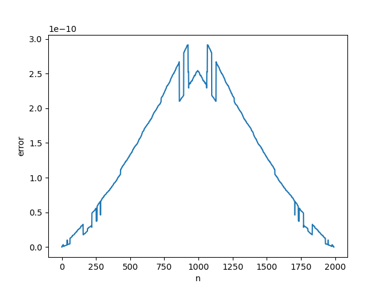

### 2.7 $n=3000$

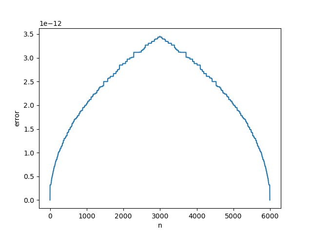

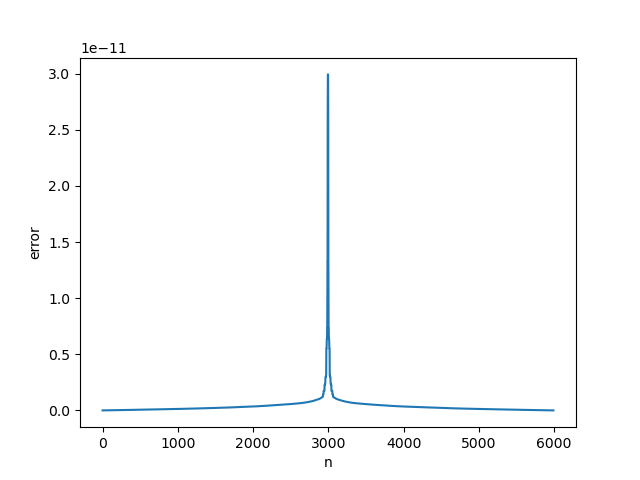

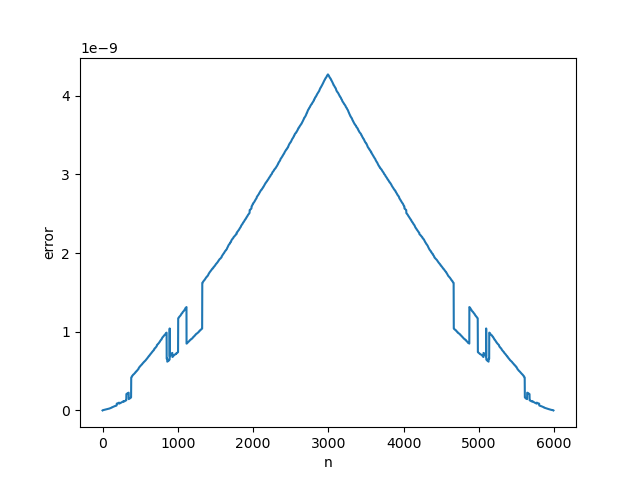

最终应用时可能要计算$R^R$所以也计算了$R^TR$的误差。（但可能也有不用的方法？）

下面是用表格的总结：

所有的矩阵都由`numpy`的`random`函数生成，其中的元素都是$[0,1]$之间的随机数。并且里面的元素是双精度浮点数。

采用对$n*5$的矩阵依次在最后一列增添列，测试`dqrinc`的正确性。其中$n$取$500,1000,6000$

通过先后计算

- $A$与$QR$的误差
- $Q^TQ$与$I$的误差
- $R^TR$与$A^TA$的误差

来测试`dqrinc`的正确性。其中实验结果汇报误差取$||\cdot||_2$范数和$||\cdot||_1$范数的结果差别不大。下面的总结是$||\cdot||_2$范数的结果。

`dqrinc`

| n    | $A$与$QR$的误差 | $Q^TQ$与$I$的误差 | $R^TR$与$A^TA$的误差 |
| ---- | -------------- | ---------------- | ------------------- |
| 500  | 1e-13        | 1e-13          | 1e-11             |
| 1000 | 1e-13        | 1e-12          | 1e-10             |
| 6000 | 1e-13        | 1e-12          | 1e-9              |

采用对$n*5$的矩阵依次在最后一列增添列，后再依次删去最后一列，直到恢复到原来的大小，测试`dqrdec`的正确性。

计算的标准和上面一样。

`dqrdec`

| n    | $A$与$QR$的误差 | $Q^TQ$与$I$的误差 | $R^TR$与$A^TA$的误差 |
| ---- | -------------- | ---------------- | ------------------- |
| 500  | 1e-13        | 1e-13          | 1e-11             |
| 1000 | 1e-13        | 1e-12          | 1e-10             |
| 3000 | 1e-13        | 1e-12          | 1e-9              |

所有的误差的作用在逆向操作的时候都被抵消了，最后呈现出可逆性。

```latex
All matrices are generated using the \texttt{random} function from \texttt{numpy}, with elements being random numbers between $[0,1]$. Additionally, these elements are double-precision floating-point numbers.

To test the correctness of \texttt{dqrinc}, a method is used where columns are sequentially added to the last column of an $n \times 5$ matrix. The values of $n$ used are $500, 1000, 6000$.

The correctness of \texttt{dqrinc} is evaluated by calculating the following errors:
\begin{itemize}
    \item The error between $A$ and $QR$.
    \item The error between $Q^TQ$ and $I$.
    \item The error between $R^TR$ and $A^TA$.
\end{itemize}
The experimental results report the errors using both the $||\cdot||_2$ norm and the $||\cdot||_1$ norm, showing little difference between them. The summary below shows the results using the $||\cdot||_2$ norm.

\begin{table}[h]
\centering
\begin{tabular}{|c|c|c|c|}
\hline
$n$    & Error between $A$ and $QR$ & Error between $Q^TQ$ and $I$ & Error between $R^TR$ and $A^TA$ \\
\hline
500  & 1e-13                      & 1e-13                        & 1e-11                           \\
1000 & 1e-13                      & 1e-12                        & 1e-10                           \\
6000 & 1e-13                      & 1e-12                        & 1e-9                            \\
\hline
\end{tabular}
\caption{Results for \texttt{dqrinc}}
\end{table}

To test the correctness of \texttt{dqrdec}, a method is used where columns are sequentially added to the last column of an $n \times 5$ matrix and then sequentially removed until the original size is restored.

The standard for calculation is the same as above.

\begin{table}[h]
\centering
\begin{tabular}{|c|c|c|c|}
\hline
$n$    & Error between $A$ and $QR$ & Error between $Q^TQ$ and $I$ & Error between $R^TR$ and $A^TA$ \\
\hline
500  & 1e-13                      & 1e-13                        & 1e-11                           \\
1000 & 1e-13                      & 1e-12                        & 1e-10                           \\
3000 & 1e-13                      & 1e-12                        & 1e-9                            \\
\hline
\end{tabular}
\caption{Results for \texttt{dqrdec}}
\end{table}

In all cases, the errors incurred during the reverse operation were compensated, ultimately demonstrating reversibility.
```